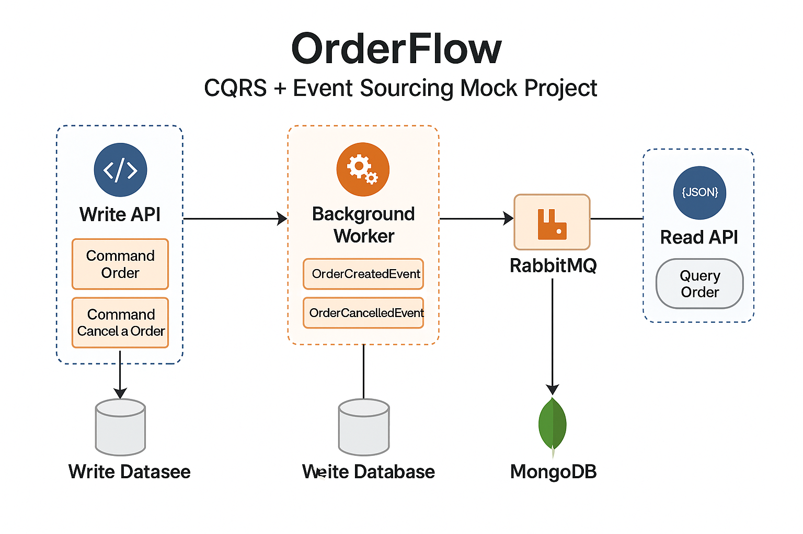

# OrderFlow 🧾

CQRS + Event Sourcing mimarisiyle inşa edilmiş örnek sipariş sistemi.

## 🔧 Kullanılan Teknolojiler
- .NET 8 Web API, MediatR
- MSSQL + MongoDB
- RabbitMQ + MassTransit
- Docker Compose

## 📐 Mimarî
Komut ve sorgu işlemleri ayrılmıştır. Event'ler üzerinden proje senkronize olur.



## 🚀 Kurulum
```bash
docker-compose up -d
```
Her bir servisi Visual Studio veya Rider ile ayağa kaldırın.

## 📦 Proje Amacı
Yazılım mimarisinde CQRS + Event Sourcing modelini kavramsal olarak göstermek.
